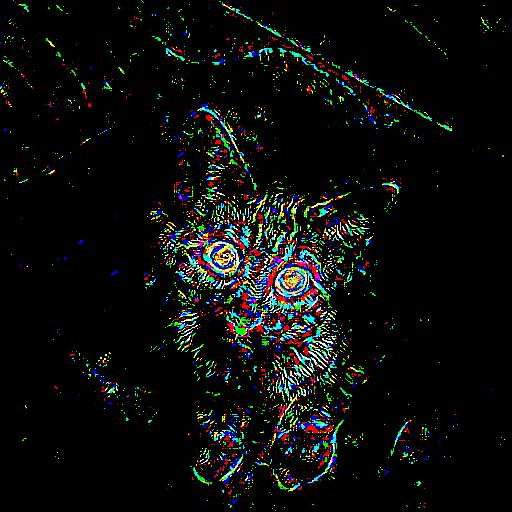
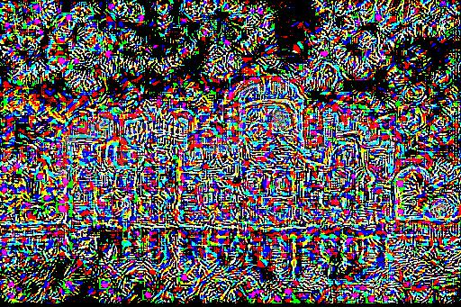

# neural_net_visualization

This repository is implemented by Pytorch.

## Implemented Paper
- [Striving for Simplicity: The All Convolutional Net](https://arxiv.org/abs/1412.6806), accepted ICLR 2015

## result
Information | cat(285) | castle(483) |
:---: | :---: | :---: |
Original Image  |  |  |
Guided Backpropagation  |  |  |

## etc...
Get Imagenet class information from [here](https://gist.github.com/yrevar/942d3a0ac09ec9e5eb3a)